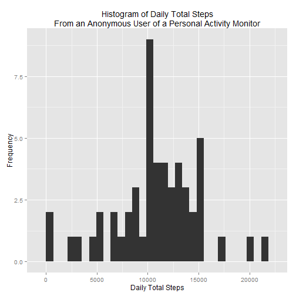
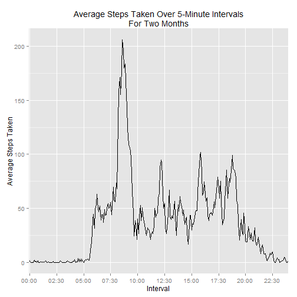
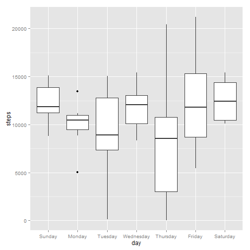
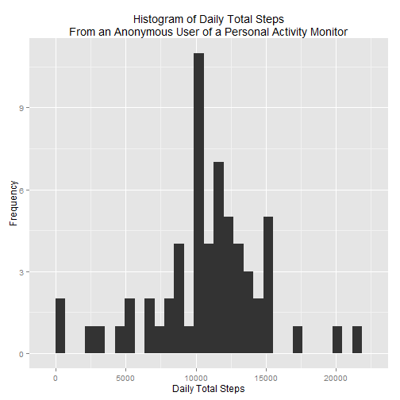
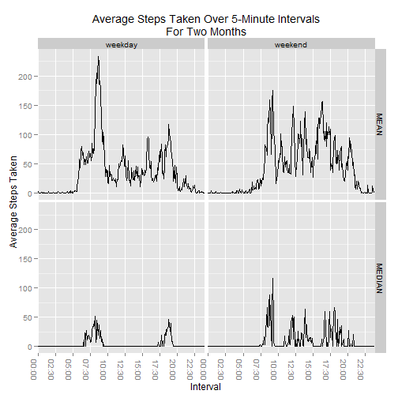

# Reproducible Research: Peer Assessment 1


## Loading and preprocessing the data

*Show any code that is needed to:*

*Load the data (i.e. read.csv())*

```r
# unzip data into folder called data in working directory if it doesnt exist
if (file.exists("./data/activity.csv") == F) {
    unzip("activity.zip", exdir = "./data")
}
# read data in
steps <- read.csv("./data/activity.csv", stringsAsFactors = F)
```


###Process/transform the data (if necessary) into a format suitable for your analysis

```r

# convert date and interval into a single POSIXct column pad the interval
# with leading zeros so Hours and minutes can be converted
dateTime <- with(steps, paste(date, sprintf("%04d", interval)))
steps$intervalBegin <- as.POSIXct(dateTime, format = "%Y-%m-%d %H%M", tz = "GMT")
# format interval as time in a new column
steps$intervalHHMM <- format(steps$intervalBegin, "%H:%M")
# day of the week
steps$day <- factor(weekdays(steps$intervalBegin), levels = c("Sunday", "Monday", 
    "Tuesday", "Wednesday", "Thursday", "Friday", "Saturday"))
# add column for weekday or weekend
steps$weekend <- ifelse(steps$day %in% c("Saturday", "Sunday"), "weekend", "weekday")
```


## What is mean total number of steps taken per day?

*For this part of the assignment, you can ignore the missing values in the dataset.*

*Make a histogram of the total number of steps taken each day*


```r
library(ggplot2)
# aggregate daily totals, keep na values in dataframe for later
agg <- aggregate(steps ~ date + day + weekend, data = steps, FUN = sum, na.action = na.pass)
# generate hist
ggplot(agg, aes(x = steps)) + geom_histogram() + labs(x = "Daily Total Steps", 
    y = "Frequency", title = "Histogram of Daily Total Steps\nFrom an Anonymous User of a Personal Activity Monitor")
```

 


*Calculate and report the mean and median total number of steps taken per day*

```r
# calc
meanSteps <- mean(agg$steps, na.rm = T)
meanSteps
```

```
## [1] 10766
```

```r
medSteps <- median(agg$steps, na.rm = T)
medSteps
```

```
## [1] 10765
```

The mean number of daily total steps is 10766.19, while 
the median is 10765.

## What is the average daily activity pattern?  

*Make a time series plot (i.e. type = "l") of the 5-minute interval (x-axis) and the average number of steps taken, averaged across all days (y-axis)*


```r
# aggregate data
intervalAgg <- aggregate(steps ~ intervalHHMM, data = steps, FUN = mean, na.rm = T)
# convert to factor for ggplot
intervalAgg$intervalHHMM <- as.factor(intervalAgg$intervalHHMM)
# generate time series plot

# create labels
breaks <- intervalAgg$intervalHHMM[seq(from = 1, to = 300, by = 30)]
ggplot(intervalAgg, aes(x = intervalHHMM, y = steps, group = 1)) + geom_line() + 
    scale_x_discrete(breaks = breaks) + labs(x = "Interval", y = "Average Steps Taken", 
    title = "Average Steps Taken Over 5-Minute Intervals\nFor Two Months")
```

 


*Which 5-minute interval, on average across all the days in the dataset, contains the maximum number of steps?*

```r
maxStepInterval <- intervalAgg[which.max(intervalAgg$steps), 1]
```

The interval beginning at 08:35 had the most steps taken on
average across the two month monitoring period.*

## Imputing missing values  

*Note that there are a number of days/intervals where there are missing values (coded as NA). The presence of missing days may introduce bias into some calculations or summaries of the data.*

*Calculate and report the total number of missing values in the dataset (i.e. the total number of rows with NAs)*


```r
missingCount <- sum(is.na(steps$steps))
```

There are 2304 missing values in the dataset.

*Devise a strategy for filling in all of the missing values in the dataset. The strategy does not need to be sophisticated. For example, you could use the mean/median for that day, or the mean for that 5-minute interval, etc.*


```r
# check out the five number summary for each day of the week
splitSteps <- split(steps$steps, steps$day)
aggSummary <- sapply(splitSteps, function(x) {
    q <- quantile(x, na.rm = T)
    m <- mean(x, na.rm = T)
    na <- sum(is.na(x))
    c(q, Mean = m, CountNA = na)
})
aggSummary
```

```
##         Sunday Monday Tuesday Wednesday Thursday Friday Saturday
## 0%           0      0       0         0        0      0        0
## 25%          0      0       0         0        0      0        0
## 50%          0      0       0         0        0      0        0
## 75%         26      7       7        13        0     16       22
## 100%       785    789     806       766      759    802      785
## Mean        43     35      31        41       29     43       44
## CountNA    288    576       0       288      288    576      288
```

```r

aggNaDate <- aggregate(is.na(steps) ~ date + day, data = steps, FUN = sum)

# get count of NA's by day
aggNaDate <- aggregate(is.na(steps) ~ date + day, data = steps, FUN = sum)
names(aggNaDate) <- c("date", "day", "countNA")
# remove days with no NA values
aggNaDate <- subset(x = aggNaDate, subset = aggNaDate$countNA != 0)

aggNaDate
```

```
##          date       day countNA
## 5  2012-11-04    Sunday     288
## 9  2012-10-01    Monday     288
## 10 2012-10-08    Monday     288
## 33 2012-11-14 Wednesday     288
## 40 2012-11-01  Thursday     288
## 50 2012-11-09    Friday     288
## 53 2012-11-30    Friday     288
## 59 2012-11-10  Saturday     288
```

```r

ggplot(agg) + geom_boxplot(aes(x = day, y = steps))
```

```
## Warning: Removed 8 rows containing non-finite values (stat_boxplot).
```

 

There are 8 days where all values are missing. These 8 days represent all 
2304 missing values is the dataset. Since these are full days rather
than random time intervals we are going to impute the missing values with 
the median of total daily steps by day of week rather than imputing the mean or
median steps per time interval.

*Create a new dataset that is equal to the original dataset but with the missing data filled in.*


```r
# aggregate steps by interval with median
aggDay <- aggregate(steps ~ day, data = agg, FUN = median)

# create new dataframe filling NAs from intervalMed dataframe
aggMod <- merge(x = agg, y = aggDay, by = "day")
names(aggMod) <- c("date", "day", "weekend", "steps", "medSteps")
aggMod$steps <- ifelse(is.na(aggMod$steps), aggMod$medSteps, aggMod$steps)
```

*Make a histogram of the total number of steps taken each day and Calculate and report the mean and median total number of steps taken per day. Do these values differ from the estimates from the first part of the assignment? What is the impact of imputing missing data on the estimates of the total daily number of steps?*


```r
# recalc hist, mean and median
ggplot(aggMod, aes(x = steps)) + geom_histogram() + labs(x = "Daily Total Steps", 
    y = "Frequency", title = "Histogram of Daily Total Steps\nFrom an Anonymous User of a Personal Activity Monitor")
```

 

```r
meanStepsMod <- mean(aggMod$steps, na.rm = T)
medStepsMod <- median(aggMod$steps, na.rm = T)
```


The mean number of daily total steps after imputing the missing values is
10820.08, while the median is 11015. Without imputing missing
values, the mean and median were 10766.19 and 10765, respectively.
Our choice of imputing the missing values by day of the week lead to an increase
in both the mean and median. This is because most of the missing values occured
on days that had medians larger than the grand median of the data set.

## Are there differences in activity patterns between weekdays and weekends?

*For this part the weekdays() function may be of some help here. Use the dataset with the filled-in missing values for this part.*

*Create a new factor variable in the dataset with two levels – “weekday” and “weekend” indicating whether a given date is a weekday or weekend day.*

*Make a panel plot containing a time series plot (i.e. type = "l") of the 5-minute interval (x-axis) and the average number of steps taken, averaged across all weekday days or weekend days (y-axis).*

```r
# generate a dataframe with the mean and median values melted in a single
# column grouped by weekday or weekend and time interval I chose not to use
# the imputed data for this section

library(reshape2)
library(plyr)
# summarize data
aggWeekend <- ddply(steps, c("weekend", "intervalHHMM"), summarize, MEAN = mean(steps, 
    na.rm = T), MEDIAN = median(steps, na.rm = T))
# melt data so mean and median are in a single column
aggWeekendMelt <- melt(aggWeekend, variable.name = "stat", value.name = "steps", 
    id.vars = c("intervalHHMM", "weekend"), measure.vars = c("MEAN", "MEDIAN"))

# generate faceted time series plot
ggplot(aggWeekendMelt) + geom_line(aes(x = intervalHHMM, y = steps, group = 1)) + 
    facet_grid(stat ~ weekend) + scale_x_discrete(breaks = breaks) + theme(axis.text.x = element_text(angle = -90)) + 
    labs(x = "Interval", y = "Average Steps Taken", title = "Average Steps Taken Over 5-Minute Intervals\nFor Two Months")
```

 

Looking at the plot above we see some differences in activity when comparing
weekdays versus weekends. On the weekend the user was active throughout the day
where as on the weekdays there was a spike of activity in the morning and the
evening. The differences become more obvious when looking at the median values
as opposed to the mean values. One possible explanation for this is the user
walks to and from work or school during the weekdays.
